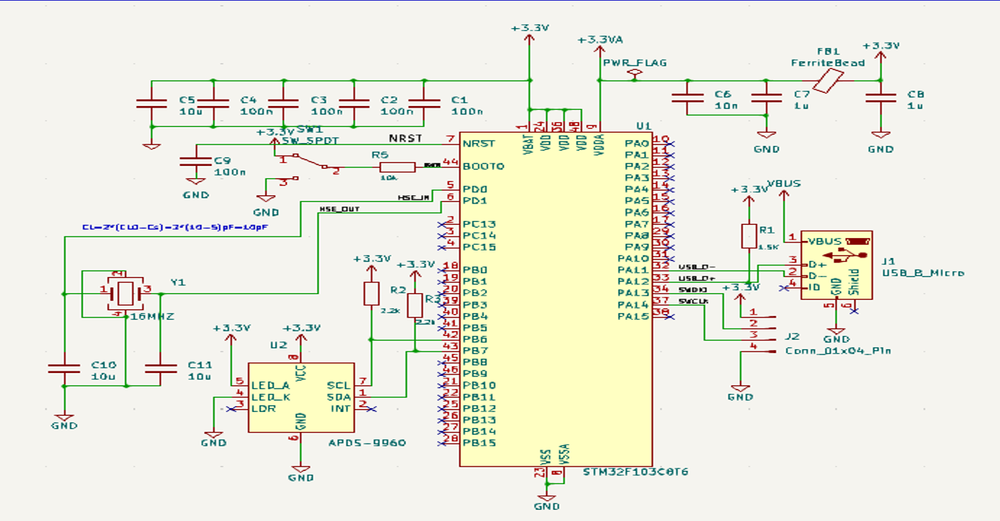
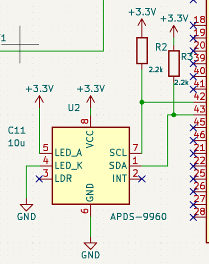

# 🛰️ APDS-9960 Gesture Sensor Project

Hey there! This is a project I worked on in the **CBMC Laboratory**. It's a custom-designed PCB that uses an **STM32** microcontroller to talk to an **APDS-9960** sensor—which detects colors, proximity, and hand gestures!

## 📸 What does it look like?

### 1. The 3D Render
This is the final look of the board, including the sensor placement and Micro-USB interface.

### 2. The Brains (STM32 Schematic)
The full circuit diagram showing the STM32 core and power regulation.

### 3. The Sensor (APDS-9960)
A close-up of the gesture sensor wiring and I2C connections.

### 4. The PCB Layout
The 2D view of the traces, footprints, and mounting holes.

## 🛠️ Tech Stack
* **Design Tool:** KiCad
* **MCU:** STM32F103C8T6 
* **Sensor:** Broadcom APDS-9960
* **Power:** 3.3V via Micro-USB

## 📂 What's in this Repo?
* **Design Files:** Core KiCad source files (`.kicad_pcb`, `.kicad_sch`, `.kicad_pro`).
* **3D Assets:** The `.step` file for the sensor[cite: 1].
* **Visuals:** PNG snapshots of the design for quick reference.

*Developed as part of the project laboratory data, Dec 2024.*
